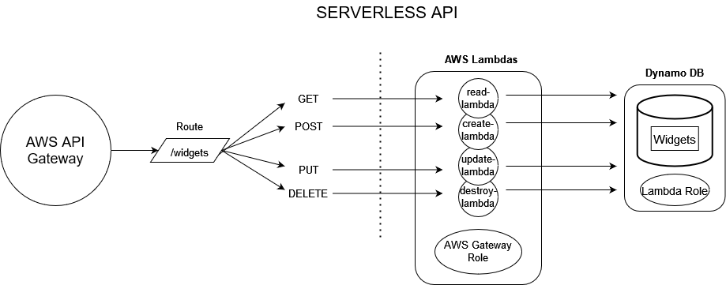

# Serverless API

This application was created for the purpose of practicing making a serverless api. 

The app uses an AWS API gateway to define the RESTful routes. AWS Lambdas perform each CRUD operation on a DynamoDB instance when their gateway triggers are activated. 

API root URL can be found [here](https://juopxastsc.execute-api.us-west-1.amazonaws.com/production/widgets)
<!-- What is the root URL to your API? -->
-----

### Routes

Route: /widgets

  Method: GET

  * Requires: (optional) query string value 'id': id of item to read. No query string returns all records

  * Output: object data from retrieved record

  Method: POST

  * Requires: request body

  * Output: object data from created record
  
  Method: PUT

  * Requires: query string value 'id': id of item to update and a request body

  * Output: object data from updated record

  Method: DELETE

  * Requires: query string value 'id': id of item to delete

  * Output: object data from deleted record

### UML Diagram

